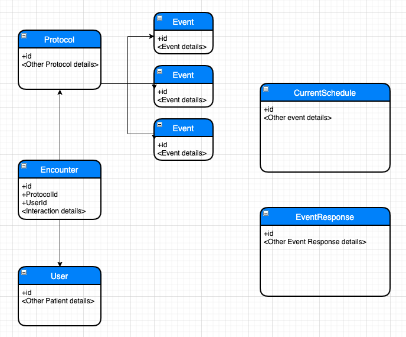

# Serverless Patient Engagement Stack

Serverless Patient Engagement stack is a simple implementation that leverages the powers of Amazon Pinpoint and Amazon Connect to influence positive healthcare outcome through timely notifications to the patients about their upcoming events related their health protocol. The assignment of health protocol begins when the patient meets their physician/health care provider. The care provider develops a health protocol that is inline with patient care events and activities; Then the physician assigns that protocol with a specific patient. <br><br>
Eg. Physician shall develop a "Diabetic Care Protocol" for a specific patient that comprises of the following events, such as checking the blood glucose level once in 5 days, Blood Pressure check once in 5 days, HbA1c report for every 3 months, Physician consultation along with blood test report once in 3 months. <br>
The implementation keeps track of these events and notifies the patient so that the patient does not miss the routine. In addition to the notifications, the implementation also enables the patient to interact with the application back with the confirmation to ease the process of appointment booking.
Eg. A patient can respond to the SMS message that says, 'A Lab technician from Octank would visit your home to collect blood samples tomorrow, Reply with OK to confirm'. <br><br>
In case of some events such as 'Talk to a patient after knee replacement surgery' may require some Care agent to call the patient and understand how the patient is responding post surgery.

## Useful commands
* `npm run build`   compile typescript to js
* `npm run watch`   watch for changes and compile
* `npm run test`    perform the jest unit tests
* `cdk deploy`      deploy this stack to your default AWS account/region
* `cdk diff`        compare deployed stack with current state
* `cdk synth`       emits the synthesized CloudFormation template

## Status
1. Toll Free Number (for 2 Way SMS communication)  - Tested with US Mobile phone number
2. Documentation (Readme.md) - To be reviewed
3. Blog - To be discussed

## Architecture
The solution makes use of serverless architecture. 
[Patient Care Service Architecture](./architecture.png)

Note that the solution realizes the backend service of notifying the patients of their events that are included in the protocol. UI application can make use of HTTP APIs exposed through API Gateway. <br>

**Flow 1: Setup requirements outside the application** 
<br>
For Amazon Pinpoint, 
- Verify your email identity. This email id is sender email for Patient Care Service. If your Amazon Pinpoint is not enabled for production, verify the patient's email id as well.
- Request support to increase SMS quota (Else you may exhaust SMS quota and you may not be able to notify through SMS channel)
- In the context of 2-Way SMS configuration, configure SNS Topic created as part of the stack execution through Amazon Pinpont Console
<br>
For Amazon Connect,
- Run curl command to configure Amazon Connect Instance <br>
1. The Lambda function, AutoConfigure subscribes to the topic for the Configure command. This function creates PTF Contact Flow and Amazon Connect Instance user. Once the process is complete, notifies admin user through email. Admin user's email id is same as sender's email id that is configured in Amazon Pinpoint as sender's email id. Verify you are able to login to Amazon Connect through Amazon Connect Instance URL, after the email notification.<br><br>

**Flow 2: Setup seed data** <br>
2. The solution provisions HTTP APIs to facilitate CRUD operations on the tables. UI application can make use of these APIs to manage Protocols, Events, Patients, Patient-Protocol associations. The assocation of patient with protocol in Encounter table, triggers the invocation of EncounterListener lambda function. This lambda function processes the insertions from the DynamoDB stream, create the EventSchedules as per the protocol requirements and populates the table, CurrentSchedule. <br>

**Flow 3: Notification functionality** <br>
3. The solution schedules an event rule runs every minute. CurrentScheduleListener, a lambda function is a target configured for the event rule. Lambda function queries the DynamoDB table, CurrentSchedule for all the eligible events that fall in that minute. Upon fetching the events, Lambda checks the notification channel, if it is SMS or CALL or EMAIL. If the event notification is through SMS, then, the solution notifies through SMS that is configured through Amazon Pinpoint.  If the event notification is through EMAIL, the solution notifies the patient using patient's email id using Amazon Pinpoint. If the event notification is through CALL, the solution creates a task for a specific contact flow (PTF Contact Flow). This task notifies the call center agent available. Call center agent shall call the patient in focus and interact with the patient for follow-up or feedback.

## Deployment

Recommended to use AWS Cloud9 enviornment.

**Requirements**
- Access to your Cloud9 IDE environment.
- Ensure curl command executes on Cloud9 IDE enviornment.
- The `cdk.json` file tells the CDK Toolkit how to execute your app. (Provide relevant input values for the parameters defined in cdk.json)


**Instructions**
As the passwords are sensitive information, use aws cli to store your password securely. You may choose to overwrite as you desire. You may need to manually clear up password if you choose to clean up the infrastructure. 
Note: 
CDK automation cannot store secure string during the execution.<br>
Password should be between 8 to 64 characters, and must contain at least one uppercase letter, one lowercase letter, and one number

```
echo "Enter your connect password. Note it down securely for your reference. Password should be between 8 to 64 characters, and must contain at least one uppercase letter, one lowercase letter, and one number"
read -s passwd
aws ssm put-parameter --name '/ptf/connect/admin/password' --type 'SecureString' --value $passwd --overwrite
```

```
git clone <code repo>
cd patient-followup-stack
npm install
cdk deploy --all
```
After the successful stack deployment, 
- Check your email (provided as value to CONNECT_ADMIN_EMAIL in cdk.json) for AWS Notification; Ensure to check SPAM folder as well. Confirm your subscription to SNS topic.
- After successful confirmation, run the following command to auto configure Amazon Connect for Patient Care Service. Get the base url for Configure API as output of ptf-app-stack.

```
curl -H "Authorization: <YourConnectAdminPassword>" -X POST <ConfigureApiUrl>/configure

```
The above command initiates the mechanism of configuring the application. Once the configuration is complete, the email id provided as connect admin will receive completion notification.

**Setup Demo**
After the successful Amazon connect configuration, run the following commands to configure test data for the demo. You can find Base URL for TableOperationsApi as exported output of ptf-app-stack.
```
curl -H "Content-Type: application/json" -H "Authorization: <YourConnectAdminPassword>" -X POST <TableOperationsApiBaseUrl>/User -d @./test/patient_john.json
curl -H "Content-Type: application/json" -H "Authorization: <YourConnectAdminPassword>" -X POST <TableOperationsApiBaseUrl>/Protocol -d @./test/protocol_db.json
curl -H "Content-Type: application/json" -H "Authorization: <YourConnectAdminPassword>" -X POST <TableOperationsApiBaseUrl>/Event -d @./test/event_1.json                          
curl -H "Content-Type: application/json" -H "Authorization: <YourConnectAdminPassword>" -X POST <TableOperationsApiBaseUrl>/Event -d @./test/event_2.json
curl -H "Content-Type: application/json" -H "Authorization: <YourConnectAdminPassword>" -X POST <TableOperationsApiBaseUrl>/Event -d @./test/event_3.json

```
Record interaction with the physician, that is encounter.
```
curl -H "Content-Type: application/json" -H "Authorization: <YourConnectAdminPassword>" -X POST <TableOperationsApiBaseUrl>/Encounter -d @./test/encounter_john_db.json 

```

Verify the details inserted using
```
curl -H "Authorization: <YourConnectAdminPassword>" -X GET <TableOperationsApiBaseUrl>/{tableName}

```

The above association of patient and protocol will add relevant events/activities for that patient. Patient Care Service shall keep track of each such event and notify the patient. Patient is now off-loaded with responsbility of keeping track of the events. Health care provider will be operationally efficient to influence the positive care outcomes for their patients.

## Roadmap
This version of the solution is maturing. We plan to provide UI interface to manage protocols, events, patients and encounters (interactions with the care providers). You may consider as the sample reference to build further on this solution as you deem fit.

## Authors and acknowledgment
Kousik Rajendran, conceptualized and developed the base functionality. Raghavendra Prakash further developed automating the deployment and added additional features such as email notification, autoconfiguration, and CRUD table operations. 

## License
MIT License

## Appendix
You can add data using the API exposed with the pattern.

| Operation | HTTP Method | URI | Details |
| --------- | ----------- | --- | ------- |
| Create | POST | https://<api_endpoint>/{tablename} | Request body is JSON payload - the record you want to insert |
| Retrieve All | GET | https://<api_endpoint>/{tablename}  | Retrieves all the records in that tablename |
| Retrieve Item | GET | https://<api_endpoint>/{tablename}/{key} | Retrieves specific item - specify value of partition key |
| Delete Item | DELETE | https://<api_endpoint>/{tablename}/{key} | Hard deletes specific item - specifiy value of partition key |
| Update Item | PUT | Not Implemented | Not Implemented |


## Quick view of Data Model

Note that relations are soft relations.

## JSON Payload Samples

**Protocol**
```
    {
        "id": "PROTOCOL_DB",
        "name": "Monthly Checkup",
        "type": "Monthly consultation with your physician",
        "domain": "Consultation",
        "expireInDays": "365",
        "createdAt": "2022-09-17T03:07:50.269Z"
    } 
```
_Note: Use random id generation for generating events_

**Event** 
``` 
    {
        "id": "EVENT_CALL_MONTHLY",
        "protocolID": "PROTOCOL_DB",
        "content": "Monthly consultation with your physician",
        "relativeTime": "900",
        "type": "CALL",
        "recurringFrequencyInDays": "30",
        "recurring": "true",
        "createdAt": "2022-10-13T03:07:50.269Z"
    } 

    {
        "id": "EVENT_WEEKLY",
        "protocolID": "PROTOCOL_DB",
        "content": "Record blood glucose level today",
        "relativeTime": "900",
        "type": "SMS",
        "recurringFrequencyInDays": "7",
        "recurring": "true",
        "createdAt": "2022-10-13T03:07:50.269Z"
    } 

    {
        "id": "EVENT_EMAIL_MONTHLY",
        "protocolID": "PROTOCOL_DB",
        "content": "Monthly consultation with your physician",
        "relativeTime": "900",
        "type": "EMAIL",
        "recurringFrequencyInDays": "30",
        "recurring": "true",
        "createdAt": "2022-10-13T03:07:50.269Z"
    }     
``` 
_Note: Ensure to associate event with protocol; Many events can be part of one Protocol_<br>
_Use the existing protocol ids to associate with events_<br>
_Event Type can be "SMS", "EMAIL", "CALL", "PUSH"_<br>
_Use random id generation for generating events_


_Note: One Protocol can contain zero or more Events_
_Use random id generation for generating events_

**Patient (Modeled as User for now)**
```
    {
        "id": "JOHNDOE",
        "name": "John Doe",
        "type": "Patient",
        "gender": "Male"
        "phoneNumber": "+91988XX0XXXX",
        "email": "jdoe@gxxxx.com",
        "createdAt": "2022-09-13T03:07:50.269Z"
    } 
```

**Encounter**
```
    {
        "id": "PROTOCOL_DB-JOHNDOE",
        "User": "JOHNDOE",
        "Protocol": "PROTOCOL_DB",
        "startedOn": "2022-09-13T00:00:00.000Z"
        "createdAt": "2022-09-13T03:07:50.269Z",
    } 
```

_Note: Ensure to start at 00:00 hrs of the encounter date_<br>
_Eg. Say, Relative time specified for event is 600-330 (minutes). With the above enounter startedOn configuration, event notification occurs at 10 AM IST. That is, 00:00 plus 270 minutes translates to 10:00 AM IST_<br>
**_330 minutes represent +5:30 hrs_**


## CleanUp 

**Run the following to clean up the infrastructure provisioned as part of this demo.**
```
aws ssm delete-parameter --name '/ptf/connect/admin/password'
cdk destroy --all
```

## Security

See [CONTRIBUTING](CONTRIBUTING.md#security-issue-notifications) for more information.

## License

This library is licensed under the MIT-0 License. See the LICENSE file.
